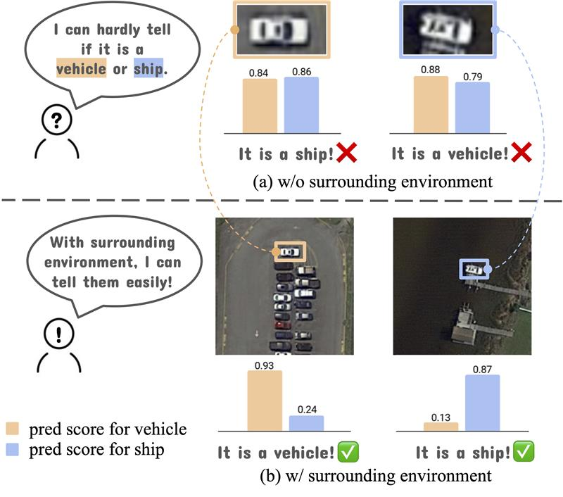
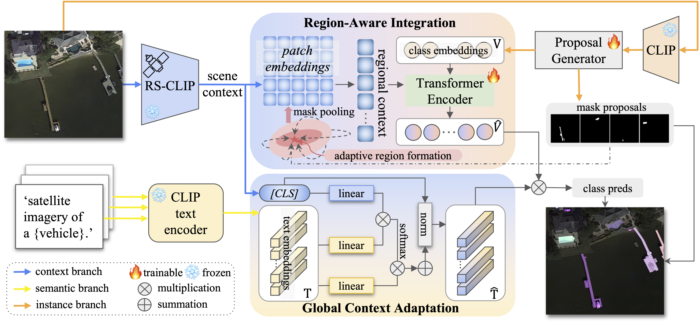

<h2 align="center">SCORE: Scene Context Matters <br>
  in Open-Vocabulary Remote Sensing Instance Segmentation
</h2>

<div align="center">
  <p>
    <a href="https://arxiv.org/abs/2507.12857"></a>
    <a href="https://arxiv.org/pdf/2507.12857"></a>
  </p>
</div>

This repository contains code for our **ICCV2025 Highlight✨** paper: 
> [**SCORE**: **S**cene **C**ontext Matters in **O**pen-Vocabulary **Re**mote Sensing Instance Segmentation](https://arxiv.org/abs/2507.12857v1)<br>
> Shiqi Huang, Shuting He, Huaiyuan Qin, Bihan Wen<br>
> ICCV 2025 (Highlight)

<div align="left">
  
</div><br/>

### Framework
<div align="center">
  
</div><br/>

## Installation
Please see [Installation Instructions](INSTALL.md).

## Datasets
Download datasets for open-vocabulary remote sensing instance segmentation from [Hugging Face ](https://huggingface.co/datasets/HuangShiqi008/SCORE).

## Getting Started with SCORE
Please see [Getting Started with Detectron2](https://github.com/facebookresearch/detectron2/blob/master/GETTING_STARTED.md) for full usage.

## Training
Download RS-CLIP ckpt from [RemoteCLIP](https://huggingface.co/chendelong/RemoteCLIP) and put it under ```SCORE/RemoteCLIP/RemoteCLIP-ViT-L-14.pt```.
```
python train_net.py --num-gpus 1 \
  --config-file configs/score_isaid_instances.yaml

python train_net.py --num-gpus 1 \
  --config-file configs/score_sior_instances.yaml
```

## Inference
###
```
bash eval_isaid.sh

bash eval_sior.sh
```


## Acknowledgement
This project is based on [FC-CLIP](https://github.com/bytedance/fc-clip). Many thanks to the authors for their great work!

## BibTeX
Please consider to cite SCORE if it helps your research.

```bibtex
@inproceedings{SCORE,
  title={SCORE: Scene Context Matters in Open-Vocabulary Remote Sensing Instance Segmentation},
  author={Huang, Shiqi and He, Shuting and Qin, Huaiyuan and Wen, Bihan},
  booktitle={Proceedings of the IEEE/CVF International Conference on Computer Vision},
  pages={12559--12569},
  year={2025}
}
```